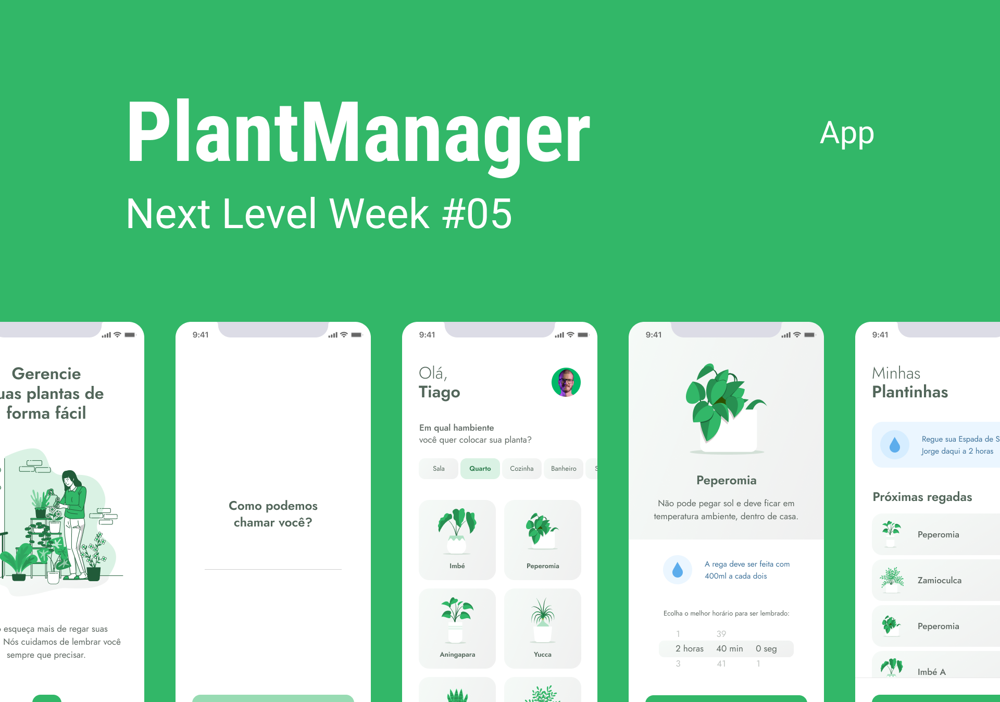

# 🌾 PlantManager 🌾

Uma aplicação para ajudar os cuidadores de plantas a não esquecerem de regá-las no tempo certo.
*Você cuida das plantinhas, e a gente cuida de você.*

    
    
<i>Projeto desenvolvido durante a Next Level Week da RocketSeat</i>

## 📱 Tecnologias
- [TypeScript](https://www.typescriptlang.org/)
- [React Native](https://reactnative.dev/)
- [Expo](https://expo.io/)
- [Node.js](https://nodejs.org/pt-br/)

## 📰 Licença
Esse projeto está sob a licença MIT. Para mais informações acesse o arquivo [LICENSE]('./LICENSE').